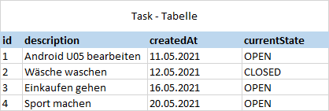
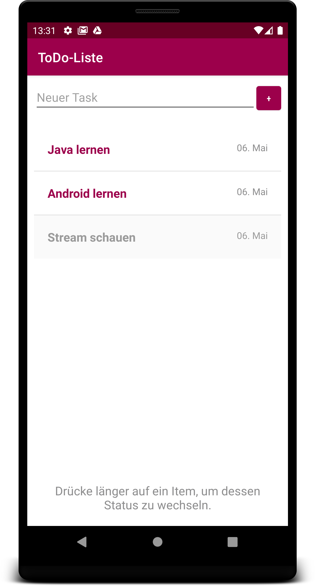

# U05-Persistente-ToDo-Liste
Erweiterung von U04-Eine-einfache-ToDo-Liste um das Speichern der erstellten Tasks mit SQLite und der Room Library

## Aufgabe

In dieser Aufgabe erweitern Sie die einfache ToDo-Listen App aus U04. Bisher gingen die erstellten Tasks nach Beenden der App verloren. Dies sollen Sie nun ändern, indem Sie mittels der [Room Persistence Library](https://developer.android.com/training/data-storage/room) die Daten in einer SQLite Datenbank speichern. Beim Starten der App sollen alle bisher gespeicherten Tasks aus der Datenbank ausgelesen und auf dem Display angezeigt werden. Beim Erstellen eines neuen Tasks soll dieser neben dem Anzeigen in der ListView nun zusätlich auch noch in der Datenbank gespeichert werden.

### Vorgaben

Gerne können Sie auf ihrer Implementierung der ToDo-Listen-App aus U04 weiter aufbauen. Gibt es allerdings noch Probleme in Ihrem Code oder besitzt Ihre App nicht die in U04 beschriebene Funktionsfähigkeit, empfehlen wir Ihnen, das von uns bereitgestellte Starterpaket zu nutzen (entspricht dem bereits veröffentlichten Lösungsvorschlag zu U04).<br/>
Sie sollten nun also eine App als Ausgangspunkt haben, mit der neue Tasks über einen Edittext und einen Add-Button erstellt und über einen eigenen ArrayAdapter in der ListView (oder auch RecyclerView) entsprechend angezeigt werden können. Jedes Task-Element wird durch eine Instanz der Task-Klasse abgebildet und besitzt neben einer eindeutigen ID einen kurzen Beschreibungstext, ein Erstellungsdatum und einen Status (offen vs. erledigt). Die Tasks werden sortiert in der ListView angezeigt (Sortierung nach Status und Erstellungsdatum) und über einen LongClick auf ein ListView-Element kann der Status des korrespondierenden Tasks geändert werden.

## Vorgehen
Die Room Persistence Library bietet eine Abstraktionsschicht für SQLite und ermöglicht Ihnen einen einfachen Datenbankzugriff. Room besteht aus den drei Hauptkomponenten:
- [Database](https://developer.android.com/reference/kotlin/androidx/room/Database): Der Hauptzugang zur Datenbank der App.
- [DAO](https://developer.android.com/training/data-storage/room/accessing-data) (Data Access Object): Ein Interface; beinhaltet Methoden, um auf die Datenbank zugreifen zu können.
- [Entity](https://developer.android.com/training/data-storage/room/defining-data): Entspricht einer Tabelle innerhalb unserer Datenbank.<br/>
Erstellen Sie zudem eine zusätzliche Klasse "RoomDatabaseHelper", welche noch einmal explizit zur Trennung von Datenbank(-zugriff) und Code fungiert. In dieser soll die Datenbank erstellt, sowie die Methoden zum Einfügen eines neuen Tasks in die Datenbank und zum Auslesen aller in der Datenbank gespeicherten Tasks, implementiert werden. Des Weiteren wird eine Klasse zur Typumwandlung von komplexen Datentypen benötigt, da diese nicht mit Room gespeichert werden können.

1. Überprüfen Sie, ob Ihre App den bisherigen Anforderungen/ Vorgaben der ToDo-Liste aus U04 gerecht wird. Gegebenenfalls können Sie sich das Starterpaket herunterladen und Ihre App auf dessen Basis weiterentwickeln.
2. Fügen Sie folgende Dependencies zur build.gradle Datei (auf Modulebene) hinzu, um die Room Persistence Library nutzen zu können:
```
implementation "androidx.room:room-runtime:2.3.0"
annotationProcessor "androidx.room:room-compiler:2.3.0"
```
3. Mit der Task-Klasse haben Sie bereits die Entität gegeben, welche in der Datenbank gespeichert werden soll. Diese Klasse repräsentiert eine Tabelle und jedes Klassenattribut eine Spalte in unserer SQLite Datenbank. Einen Überblick, wie unsere Datenbank aussehen soll, bietet das Bild unten. Damit die Room Library auch versteht, dass es sich bei Task um eine Entität handelt, muss die Klasse entsprechend annotiert werden. Beachten Sie dabei auch, dass jede Entität einen sog. **Primärschlüssel** besitzt, also ein (oder auch mehrere) Attribut(e), welches jeden Datenpunkt unserer Datenbank eindeutig identifiziert.<br/>

<br/><br/>

4. Implementieren Sie das DAO. Das DAO muss ein Interface (bevorzugt) oder eine abstrakte Klasse sein. Das DAO soll Methoden enthalten, die abstrakten Zugriff auf die Datenbank erlauben. Ihr DAO soll dabei drei Methoden enthalten: 
- Eine Methode zum Auslesen aller in der Datenbank gespeicherten Tasks
- Eine Methode zum Einfügen eines einzelnen Tasks in die Datenbank
- Eine Methode zum Updaten eines Tasks, wenn sich dessen Status verändert hat
5. Erstellen Sie eine Klasse für die Room Database. Diese darf nicht instanziiert werden können (abstract) und muss von RoomDatabase erben. Vergessen Sie auch hier nicht, die Klasse dementsprechend zu annotieren. Durch eine abstrakte Getter-Methode macht die Datenbank Ihr DAO verfügbar. Optional: Um zu vermeiden, dass mehrere Datenbank-Instanzen gleichzeitig aktiv sind, könnten sie das [Singleton-Pattern](https://en.wikipedia.org/wiki/Singleton_pattern) verwenden.
6. Nachdem mit Room keine komplexen Objekte, wie Date oder TaskState (Strings ausgeschlossen!) gespeichert werden können, muss für derartige Daten ein **TypeConverter** eingesetzt werden. Erstellen Sie deshalb eine Klasse, die Methoden bereitstellt, um komplexe in primitive Datentypen umzuwandeln und vice versa. Typkonverter müssen dabei mit **@TypeConverter** annotiert werden. Zudem müssens Sie der Room-Database-Klasse die **@TypeConverters** - Annotation verleihen, damit Room über die von Ihnen definierte Konverterklasse informiert ist. Eine kurze, prägnante Zusammenfassung, mit verständlichem Beispielcode ist [hier](https://developer.android.com/training/data-storage/room/referencing-data) zu finden.
7. Erstellen Sie nun eine Klasse "RoomDatabaseHelper", mit derer Hilfe Sie den kompletten Datenbank-Zugriff bündeln und verwalten können. In diesem Helper soll die Datenbank erstellt werden: 
```
AppDatabase db = Room.databaseBuilder(getApplicationContext(), AppRoomDatabase.class, "database-name")
                      .allowMainThreadQueries()
                      .build();
```
Außerdem soll die Helper-Klasse eine Methode zum Einfügen eines Tasks in die Datenbank, sowie zum Auslesen aller in der Datenbank gespeicherten Tasks, enthalten. 
Anmerkung: Room unterstützt normalerweise keinen Zugriff über den Haupt-Thread, außer man ruft explizit allowMainThreadQueries() auf. Das wird allerdings NICHT empfohlen, da sonst der UI-Thread blockiert werden könnte (Für diese Übungsaufgabe ist das noch ok, asynchrones Arbeiten sehen wir uns dann in den nächsten Übungsblättern erst an).
8. Integrieren Sie die Datenbank in ihre ToDo-App. Initialisieren Sie zunächst den RoomDatabaseHelper in der onCreate() Methode und binden Sie ihn an den passenden Stellen im Code ein: 
- Beim Starten der App sollen alle bereits in der Datenbank gespeicherten Einträge ausgelesen und entsprechend in der ListView angezeigt werden
- Beim Hinzufügen eines neuen Tasks soll dieser zunächst in der Datenbank gespeichert und dann in die entsprechende Datenstruktur geladen werden, sodass dieser mithilfe des CustomAdapters und der ListView auf dem Display angezeigt wird
- Bei eine LongClick auf ein ListView-Element wird der Status des darunterliegenden Tasks verändert, was dementsprechend auch in der Datenbank upgedatet werden soll

## Mögliche Erweiterungen

### Löschen von Tasks
Es können aktuell zwar immer neue Tasks hinzugefügt und auch als abgeschlossen markiert werden, allerdings können bestehende Tasks nicht komplett entfernt werden. Erweitern Sie Ihren Code also dementsprechend, um einen Task sowohl von der ListView zu entfernen und ergänzen Sie eine entsprechende Datenbankabfrage, die das Löschen eines einzelnen Tasks aus der Datenbank erlaubt. Das Löschen könnte z.B. implementiert werden, indem in einem einzelnen ListView-Eintrag ein zusätliches Delete-Icon mit OnClickListener ergänzt wird.

### Filtern von Tasks
Um nur offene Tasks oder Tasks eines bestimmten Datums anzeigen zu lassen, können sie eine Art Filterfunktion implementieren. Im simpelsten Fall können unterschiedliche Buttons dazu genutzt werden, nur bestimmte Tasks anzeigen zu lassen. Dazu müssen entsprechende Datenbankabfragen im DAO, sowie entsprechende Methoden in Ihrem RoomDatabaseHelper ergänzt werden.

## Screenshots der Anwendung

|  Erstellte Tasks bleiben nun auch nach Beenden der App erhalten und werden automatisch beim nächsten Start in die ListView geladen   |
|:------:|
|    |
